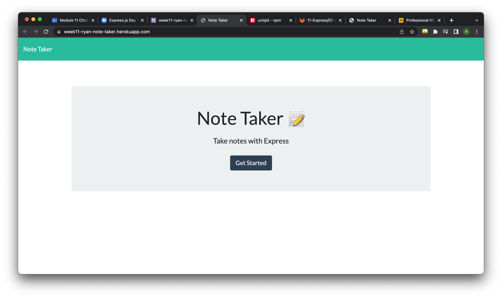
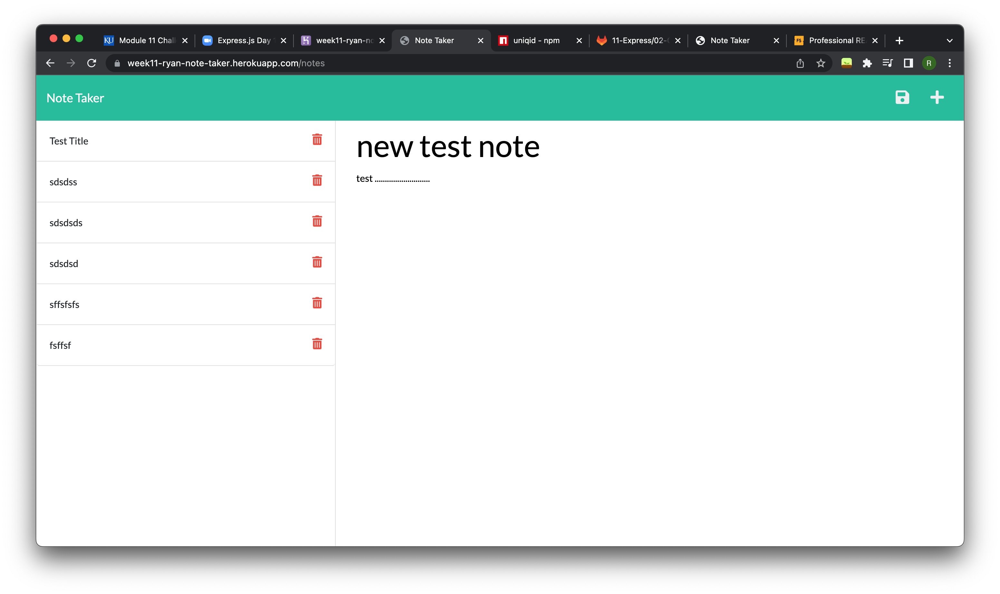

# week11-ryan-green-note-taker

## Description

Using the starter code fro a note taking app, I used express, an npm package called "uniqid" to get the notes page and the inex.html to show up. Then using GET and POST the app now recives a note that is written in the field after hitting the save icon and stores them in the lef hand column.

## Installation

Herkoku deployment
https://week11-ryan-note-taker.herokuapp.com/

## Usage

After hitting get started on the homepage, enter a note into the right hand field and click the save icon to save it. The note will show in the left column. Clicking it will display the note in the right pane. Click the plus icon to write a new note.

